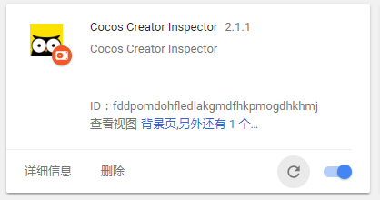
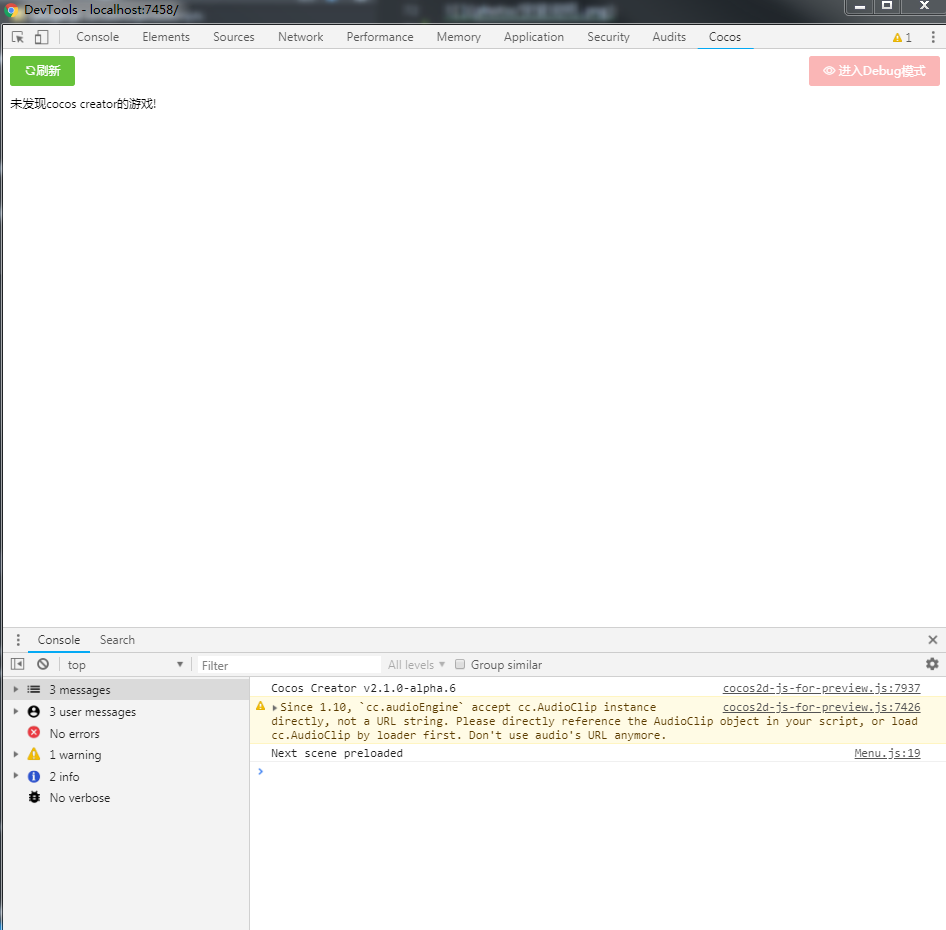
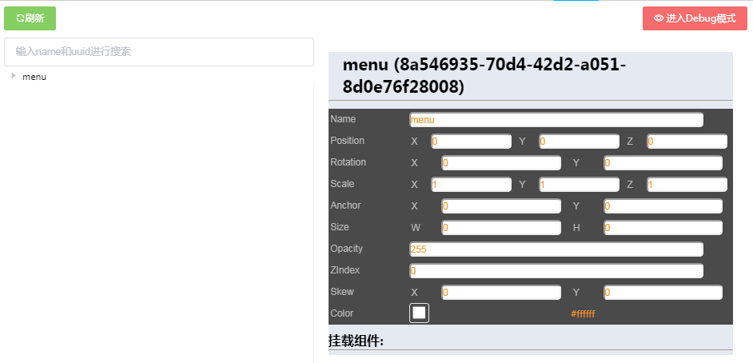

# 如何运行项目

> Author: huzi(moustache)<br>
> Date: 18-9-6 14:13

## 如何编译项目

### 安装依赖

在使用之前,需要在项目目录 CocosCreatorInspector 下执行命令

```bash
npm install
```

初始化项目所需的依赖包

### 编译

在项目目录运行编译命令

```bash
npm run build
```

会生成 dist 目录,目录下即打包所需要的所有文件

## 如何打包项目

### 命令行方式

- 为了能够在计算机上让 gulp 直行任务，所以我们需要全局安装 gulp。在终端执行：

```bash
cnpm install gulp -g
```

- 安装完成后，我们可以同样通过命令查看是否安装成功：

```bash
gulp -v
```

- 运行打包任务

```bash
gulp packageCrx
```

### chrome 方式

进入 chrome 扩展程序页面。


点击"打包扩展程序"，分别选择 dist 文件夹和 bin/dist.pem 文件，完成打包。


## 如何安装项目

如果已经上架，可以直接去 chrome 商店下载。

否则，安装过程如下：

进入 chrome 扩展程序页面。


点击"加载已解压的扩展程序"，选择 dist 文件夹。(要先进入开发者模式))


安装完成！



## 如何使用项目

打开一个 cocos 项目，在 chrome 上运行，如下：


进入开发者模式的 cocos 栏。



点击刷新，开始使用。


