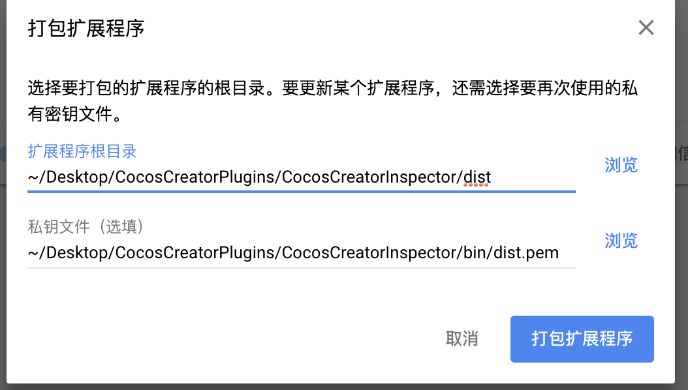

# 如何编译项目

## 安装依赖

在使用之前,需要在项目目录CocosCreatorInspector下执行命令
```
npm install
```
初始化项目所需的依赖包

## 编译
在项目目录运行编译命令
```
npm run build
```
会生成dist目录,目录下即打包所需要的所有文件

# 如何打包项目

## 命令行方式
- 为了能够在计算机上让gulp直行任务，所以我们需要全局安装gulp。在终端执行：
```$xslt
cnpm install gulp -g
```
- 安装完成后，我们可以同样通过命令查看是否安装成功：
```$xslt
gulp -v
```
- 运行打包任务
```$xslt
gulp packageCrx
```

## chrome方式

进入chrome扩展程序页面。


点击"打包扩展程序"，分别选择dist文件夹和bin/dist.pem文件，完成打包。



# 如何安装/使用项目

如果已经上架，可以直接去chrome商店下载。

否则，安装过程如下：

进入chrome扩展程序页面。


点击"加载已解压的扩展程序"，选择dist文件夹。

