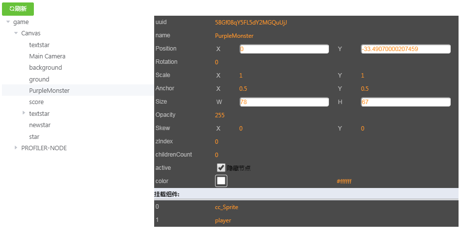
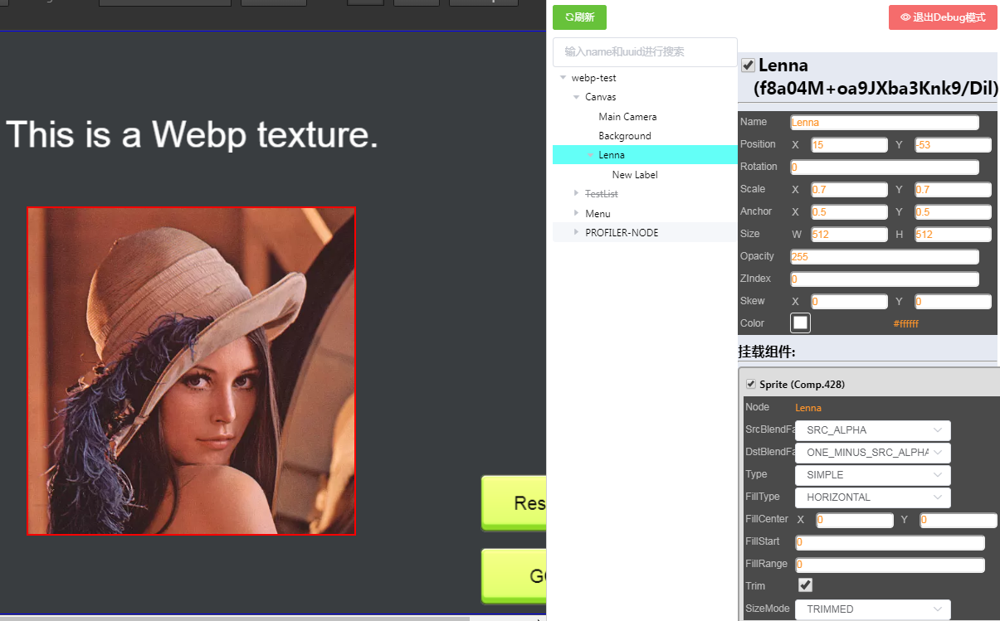

# 程序修改

> Author: huzi(moustache) 
> Date: 18-8-27 11:15

本篇文档介绍我在源程序的基础上进行的修改。

源程序效果图：

现程序效果图：

 - 程序优化：
   1. 改善了文件结构，使其模板化。
   1. 改善了通讯结构，现在传递type和value两个属性
   1. 修改了vue的构造，降低其耦合度
   2. 封装插件到ccIns变量下，防止污染原环境。
   2. 使node中所有的属性都能进行修改，并且能成功分辨number和string两种类型。
   3. 添加自定义的component属性显示，而不仅仅显示名字。
   4. 添加了节点树的实时更新。
   5. 添加了节点属性的实时更新。
   6. 由于节点属性的实时更新，现在在修改节点属性时，会暂停游戏。
   4. 优化了节点树的UI，现在可以可视化显示active。
   5. 优化了节点树的UI，现在可以高亮点击节点。
   6. 优化了节点脚本属性的UI，现在可以分开显示节点的脚本，并且进行隐藏。
   7. 优化了节点属性的UI，现在uuid放在姓名后面，并且可以通过选择框设置active和enabled了。
   8. 添加了更新状态重连，切换场景或者重新加载场景会自动更新了。

 - 功能添加：
   1. 添加了config规范，可以通过修改config中的json文件，改变脚本中的属性值。
   2. 添加了节点树中节点的拖拽功能，可以通过拖拽，修改节点树中节点的层级关系。
   4. 添加了搜索框，可以通过name、uuid和type搜索节点。
   5. 添加了DEBUG模式，可以通过右上角的DEBUG按钮进入DEBUG模式.
      - DEBUG模式下，点击树中的节点，可以在游戏中显示对应节点的边框（红色）。
      - DEBUG模式下，移动鼠标到游戏中节点上，可以显示该节点的边框（蓝色）。
      - DEBUG模式下，点击游戏中的节点，可以在游戏中显示对应节点的边框（红色），并且高亮节点树上对应的节点。
      - DEBUG模式下，节点发生移动或删除，边框也会跟着发生移动或者删除。
   6. 通过ccIns.n0，可以直接访问现在选中的节点。
   3. 源cocos程序修改导致页面刷新后，不需要再次点击刷新按钮，程序会自动识别更新。
   4. 添加了所有组件，特别是自定义组件的属性显示。
   5. 添加了枚举量的显示和设置。
   6. 添加了数组的显示和设置。
   7. 添加了向量的显示和设置。

  

