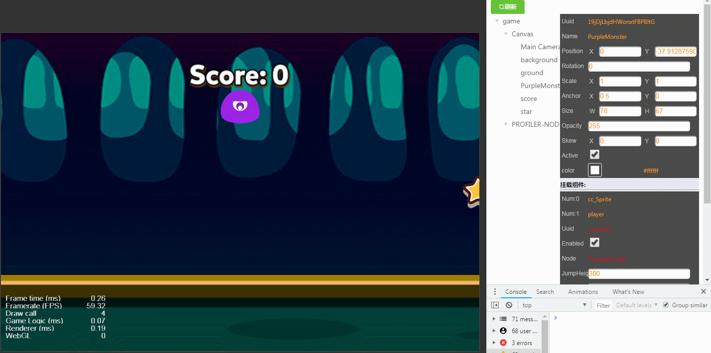
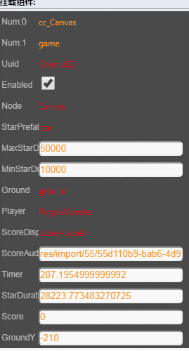
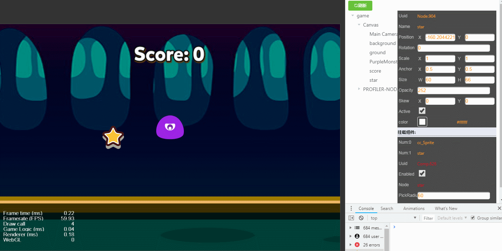
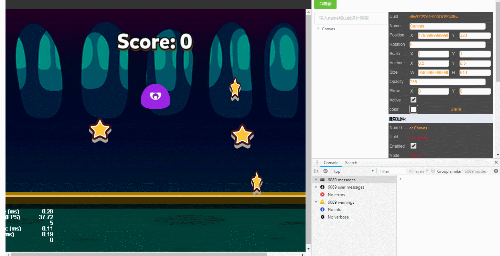
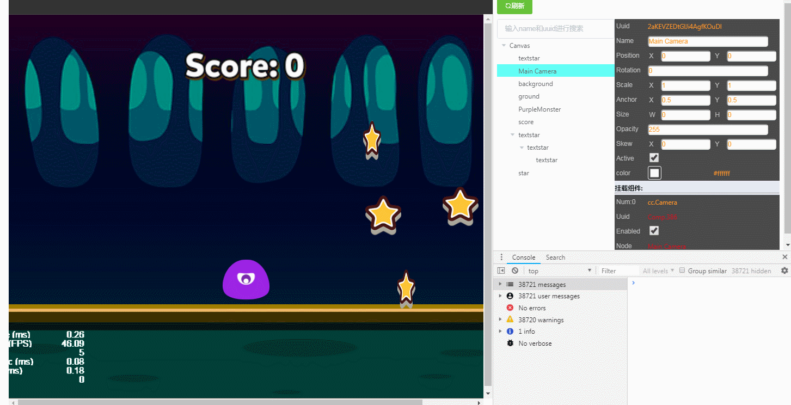
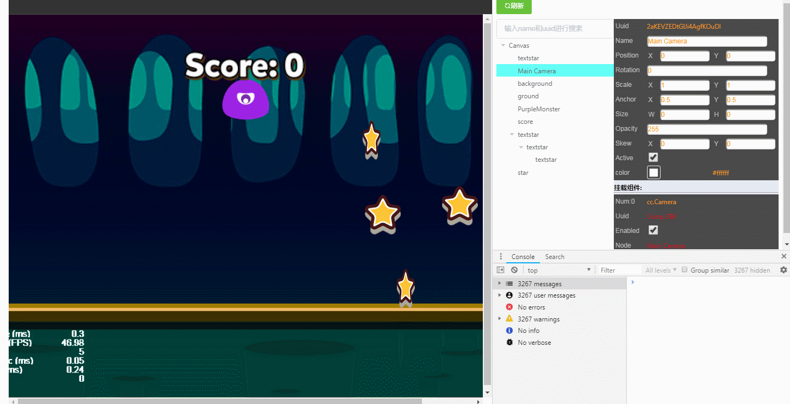
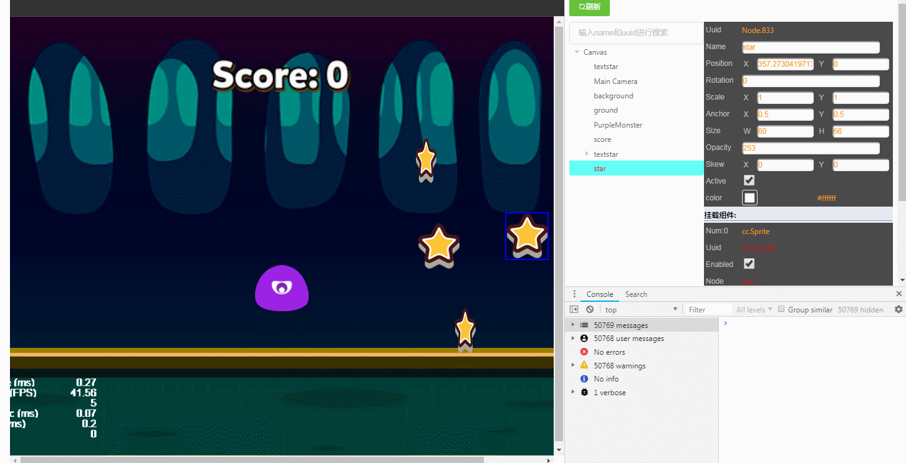

# 项目功能演示

> Author: huzi(moustache)  
> Date: 2018年7月29日 星期日 下午4:10

测试小游戏地址：https://github.com/bilibiliChangKai/CocosCreatorInspectorTestGame

## v1.0 

fork时的版本，请去原fork地址查看。

## v2.0

所有节点属性和自定义脚本公有属性都可以修改。

两种方式：拖拽节点属性（number值）和直接修改节点属性。

内部节点的变化会自动渲染到页面上。

（Timer自动变化。）

节点树的变化会映射到页面上。

## v2.2

点击节点高亮。

进行树搜索。（'u:'前缀搜索uuid，'t:'前缀搜索组件类型，无前缀搜索姓名，空格分割搜索条件）

进入DEBUG模式，选择节点。

进入DEBUG模式，修改属性。

