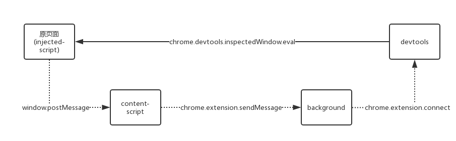
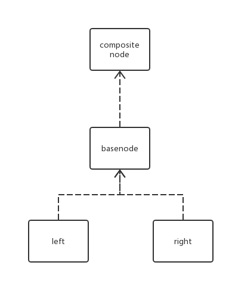

# chrome cocos inspector 工作原理

> Author: huzi(moustache) 
> Date: 18-7-27 15:45

本项目使用技术如下：

 1. chrome插件开发
 2. vue-cli
 3. webpack
 3. gulp

## 项目目录

### 总目录：

~~~bash
$ tree . -L 1 
.
├── README.md
├── bin
├── dist
├── doc
├── gulpfile.js
├── node_modules
├── package-lock.json
├── package.json
├── src
├── theme
└── webpack.config.js
~~~

 - dist：目录。源代码编译后的文件夹。
 - node_modules：目录。vue-cli依赖的库。
 - src：目录。vue-cli源码，包含chrome插件开发内容，通过webpack编译vue到dist中。
 - theme：目录。用于修改element-ui中CSS属性的文件夹。
 - gulpfile.js：通过gulp将编译后的代码打包成crx压缩包。
 - webpack.config.js：webpack详细过程。

### src目录：

~~~bash
$ tree src -L 2
src
├── assets
│   └── images
├── config
│   ├── injectedScripts.json
│   └── nodebase.json
├── dev
│   ├── backgroundScripts.js
│   ├── contentScripts.js
│   ├── dev.html
│   ├── dev.js
│   ├── devInspector
│   └── injectedScripts
├── index
│   ├── App.vue
│   ├── index.html
│   └── main.js
├── manifest.json
└── popup
    ├── App.vue
    ├── main.js
    └── popup.html
~~~

 - manifest.json：chrome插件配置文件。关键文件。
 - dev：目录。开发的主要目录。
 - index：目录。插件配置页。
 - popup：目录。popup页。
 - config：目录。用户可以自己修改config中的json文件，json说明请见doc/config规范.md。

### dev目录（主要开发）

~~~shell
$ tree src/dev -L 2
src/dev
├── backgroundScripts.js
├── contentScripts.js
├── dev.html
├── dev.js
├── devInspector
│   ├── App.vue
│   ├── basenode
│   ├── compositenode
│   ├── devInspector.html
│   ├── main.js
│   ├── plugin.js
│   └── util.js
└── injectedScripts
    ├── connect.js
    ├── debugGraphics.js
    ├── enum.js
    ├── main.js
    ├── plugin.js
    ├── storage.js
    ├── timer.js
    └── util.js
~~~

- backgroundScripts.js：chrome背景页脚本
- contentScripts.js：chrome在页面加载结束后注入原页面的脚本，起到连接的功能
- dev.html/dev.js：用于生成chrome开发者界面的Cocos-panel
- devInspector：devtools部分
  - App.vue：用于渲染Cocos-panel上的界面
  - basenode：目录，包含着各种基本组件模版
  - compositenode：目录，包含着各种组合后的组件模板，一般是由basenode组合而来
  - plugin.js：接口函数，和injectedScripts/plugin.js中的函数一一对应
  - util.js：包含各种util函数
- injectedScripts：注入原页面的部分（其中只有main.js真正执行，其他文件都是初始化文件和函数定义文件，注入没有先后顺序之分）
  - connect.js：声明通讯类型和通讯结构
  - debugGraphics.js：定义DEBUG模式中，cc.Graphics渲染边框的代码
  - enum.js：定义ccIns.Enum，用于保存枚举值
  - main.js：检测页面是否包含cocos游戏，并初始化节点树，启动定时器
  - plugin.js：定义devtools通过eval函数调用的接口函数
  - storage.js：定义ccIns.gameMemoryStorage，用于保存节点
  - timer.js：定义ccIns.Timer，初始化定时器
  - util.js：包含常用的函数

## 项目编译原理：

### 1. npm install

通过package.json文件安装指定依赖。

### 2. npm run build

build在package.json文件中，对应的指令"cross-env NODE_ENV=production webpack --progress --hide-modules"

其中，cross-env NODE_ENV=production作用是可以跨平台设置NODE_ENV变量，webpack --progress --hide-modules是为了打包时显示进度条，并且忽略依赖的第三方模块。

执行完毕后，chrome插件所需要的文件和mainfest.json都会被编译到dist文件夹里。

PS：webpack打包执行的指令在webpack.config.js中，可以看到以下这种情况：

~~~js
    entry: {
        devInspector: path.resolve(__dirname, './src/dev/devInspector/main.js'),
    },
    //devInspector.html
    new HtmlWebpackPlugin({
      template: __dirname + "/src/dev/devInspector/devInspector.html",
      filename: 'devInspector.html',
      inject: 'body',
      chunks: ['devInspector']
    }),
~~~

此处意思是直接将main.js注入到html中，而main.js实际上渲染的是App.vue，因此App.vue才是文件入口。

### 3. gulp packageCrx

执行gulpfile.js中的packageCrx命令。该命令将执行：

~~~shell
$ chrome.exe --pack-extension=./dist --pack-extension-key=./bin/dist.pem
~~~

由于chrome插件根据密钥判断是否为同一个插件，因此需要dist.pem文件。

打包后就可以在bin文件夹里获得cc-inspector.crx。

## 项目运行原理：

和一般的chrome插件类似，项目中的脚本可分成两个部分：

1. 注入原页面的injectedScript，用来获取节点信息，之后传递给devtools。位于dev/injectedScripts文件夹内。
2. 在devtools上加载的vue脚本，用来渲染页面，并动态绑定传来的节点信息。位于dev/devInspector文件夹内。

项目初始化分为三个阶段：

1. 将vue模板实例化，渲染devtools的界面。
2. 建立连接（服务端）等待原界面（客户端）发送的数据，两者的通讯过程如下图。
3. 点击刷新按钮，向原页面注入injectedScript并运行main.js脚本，原页面开始向devtools发送数据。

项目成功运行后，数据的双向绑定的过程如下：

- 正向：devtools修改节点属性值，通过eval函数，执行注入脚本中的接口函数，更新原页面上的对应节点属性。
- 反向：原页面的属性变化后，通过图中虚线过程的异步通讯，将变化后的属性传递给devtools。

## 项目运行过程代码细节：

### 1. 将vue模板实例化，渲染devtools的界面

整个vue模板的入口位于devInspector/main.js，在main.js内部，进行了两件事。
 
 - 进行其他模板初始化：

~~~js
// main.js
// 自定义util函数加载
import util from './util.js';
util();
// 其他模板加载
Vue.component('Node', MyNode);
Vue.component('SlideNode', SlideNode);
// ...
~~~

- 将App.vue挂载到devInspector/devInspector.html上：

~~~js
// main.js
import App from './App.vue';
// ...
new Vue({
  el: '#app',
  render: h => h(App)
});
~~~

因此，实际的入口其实是App.vue。在App.vue中，渲染左边的树形节点和右边的属性框。

 - 左边的树形节点：

~~~html
<NodeTreeProperty :treeData="treeData" 
                  nodeKey="uuid" 
                  :treeProps="treeProps" 
                  ref="tree" />
~~~

 - 右边的属性框：属性框中包括节点属性和挂载在节点上的脚本属性。

~~~html
<NodeBaseProperty :itemData="treeItemData" />
<ComponentsProperty :components="treeItemData.components" />
~~~

属性框中模板层层嵌套，在此不展开描述，详情请见后面的模板详解。

### 2. 建立连接（服务端）等待原界面（客户端）发送的数据

由于background是持续时间最长的脚本程序，因此连接以background作为中转站。

先连接background，然后在backgrond添加监听器。

监听器收到消息后，更新数据，再由vue的绑定机制重新渲染页面上节点。

~~~js
// App.vue
created() {
    // ...

    // 建立和背景页面的连接，以原页面的tabId作为区分
    let backgroundPageConnection = chrome.extension.connect({
      name: btoa("for" + String(chrome.devtools.inspectedWindow.tabId))
    });

    // 添加监听器
    backgroundPageConnection.onMessage.addListener(this._handlePostData.bind(this));
}
~~~

### 3. 向原页面注入injectedScript并运行main.js脚本

"刷新"按钮点击后，触发函数。

通过import，得到所有需要注入的文件，最后通过chrome.devtools.inspectedWindow.eval()写入原页面。

注入顺序：配置文件 -> 初始化脚本 -> main.js

~~~js
// App.vue
import injectPlugin from "../injectedScripts/plugin.js";
import injectConnect from "../injectedScripts/connect.js";
import injectEnum from "../injectedScripts/enum.js";
import injectTimer from "../injectedScripts/timer.js";
import injectStorage from "../injectedScripts/storage.js";
import injectDebugGraphics from "../injectedScripts/debugGraphics.js";
import injectUtil from "../injectedScripts/util.js"
import injectMain from "../injectedScripts/main.js";

import injectConfig from "../../config/injectedScripts.json";

// ...
onBtnClickUpdatePage(e) {
      // 注入配置文件
      let code = this._getConfigString();
      chrome.devtools.inspectedWindow.eval(code);
      
      // 注入初始化脚本
      let scripts = [injectUtil, injectDebugGraphics, injectConnect,
         injectPlugin, injectEnum, injectTimer, injectStorage];
      for (let script of scripts) {
        let code = this._getInjectScriptString(script);
        chrome.devtools.inspectedWindow.eval(code);
      }
      
      // 运行main函数
      code = this._getInjectScriptString(injectMain);
      chrome.devtools.inspectedWindow.eval(code, function(rtn) {
        console.log("刷新成功!");
        // 执行回调函数，此回调函数用于页面刷新重新注入文件
        if (typeof e == "function") {
          let func = e;
          func(rtn);
        }
      });
}
~~~

一共注入八个脚本和一个配置文件，其中：

- injectedScripts.json：配置文件，里面定义了参数的属性，可见'config规范.md'。
- connect.js：声明通讯类型和通讯结构
- debugGraphics.js：定义DEBUG模式中，cc.Graphics渲染边框的代码
- enum.js：定义ccIns.Enum，用于保存枚举值
- plugin.js：定义devtools通过eval函数调用的接口函数
- storage.js：定义ccIns.gameMemoryStorage，用于保存节点
- timer.js：定义ccIns.Timer，初始化定时器
- util.js：包含常用的函数
- main.js：检测页面是否包含cocos游戏，并初始化节点树，启动定时器
 

~~~js
// main.js
// 检测是否包含cc变量
// 如果存在cc空间，游戏存在
if (cc) {
    if (!ccIns.isNotFirst) {
        ccIns.isNotFirst = true;
        // 初始化debug模式
        ccIns.initDebugGraphicsNode();

        // 添加新场景刷新时的触发器
        //  场景重启时，重新挂载drawnode节点，并恢复DEBUG模式
        cc.director.on(cc.Director.EVENT_AFTER_SCENE_LAUNCH, (e) => {
            // ...
        }, cc.director);

        // 添加节点刷新帧
        cc.director.on(cc.Director.EVENT_AFTER_DRAW, (e) => {
            // ...
        }, cc.director);

        // 添加节点树刷新帧
        cc.director.on(cc.Director.EVENT_AFTER_DRAW, (e) => {
            // ...
        }, cc.director);

        // 检测cc.Graphics是否存在
        if (cc.Graphics) {
            // 添加Graphics刷新帧
            cc.director.on(cc.Director.EVENT_AFTER_DRAW, (e) => {
                // ...
            }, cc.director);
        } else {
            ccIns.sendMsgToDevTools(ccIns.Connect.msgType.notSupport, "不支持Debug模式!");
            console.log("can't use Debug model");
        }
    }
    
    // 发送节点树
    ccIns.sendNodeTreeInfo();
    return true;
} else {
    ccIns.sendMsgToDevTools(ccIns.Connect.msgType.notSupport, "不支持调试游戏!");
    console.log("not find cocos creator game");
    return false;
}
~~~

发送的节点树包含所有节点的uuid。

发送节点树的同时，会将节点树上的节点储存在ccIns.gameMemoryStorage中（key - uuid，value - node）。接口函数则通过ccIns.gameMemoryStorage中的节点更新数据。

### 4. 正向数据绑定过程

修改节点：

1. 通过devInspector/plugin.js中函数，向原页面注入脚本，运行injectedScripts/plugin.js中对应的接口函数，修改节点属性。
2. 节点属性修改完毕后，通过_freshNode()，运行接口函数ccIns.getNodeInfo(uuid)，发送更新后的节点信息给devtools，显示修改后的属性。

修改树：

1. 通过devInspector/plugin.js中函数，向原页面注入脚本，运行injectedScripts/plugin.js中对应的接口函数，修改树层级。
2. 树的层级改变后，通过cc.director.on绑定的定时器，定时更新，显示修改后的树。

### 5. 反向数据绑定过程

节点刷新：

1. 通过cc.director.on绑定的定时器，定时发送ccIns.Connect.msgType.refleshInfo信号。
2. devtools收到信号后，运行接口函数ccIns.getNodeInfo(uuid)，重新获取数据，刷新界面。

树刷新：

 1. 定时器定时发送节点树信息。
 2. devtools收到节点树信息后，与当前节点树比较，如果不同，更新现有节点树（不是直接替代）。

## vue模板详解：

devtools中的vue模板分为三个部分：

~~~shell
├── App.vue
├── basenode
│   ├── ArrayNode.vue
│   ├── BoolNode.vue
│   ├── ColorNode.vue
│   ├── EnumNode.vue
│   ├── MultiNumberNode.vue
│   ├── NumberNode.vue
│   ├── StringNode.vue
│   ├── VectorNode.vue
│   ├── left
│   │   ├── Node.vue
│   │   └── SlideNode.vue
│   └── right
│       ├── CheckBox.vue
│       ├── ColorPicker.vue
│       ├── InputBox.vue
│       └── SelectBox.vue
└── compositenode
    ├── ComponentProperty.vue
    ├── ComponentsProperty.vue
    ├── NodeBaseProperty.vue
    └── NodeTreeProperty.vue
~~~

- App.vue：devtools顶层模板。依赖compositenode中的模板。
  - compositenode：目录。中间层模板。
  - ComponentProperty.vue：组件模板，只显示一个组件的属性信息。依赖basenode。
  - ComponentsProperty.vue：节点组件模板，显示一个节点中所有组件的信息。依赖ComponentProperty.vue。
  - NodeBaseProperty.vue：节点属性模板，显示一个节点中属性的信息，依赖basenode。
  - NodeTreeProperty.vue：节点树模板，显示节点树中节点的信息。
- basenode：目录。底层模板。
  - left：目录。表示属性显示的左侧值（key值）。和right组合成各种节点。
    - Node.vue：基本等同span。
    - SlideNode.vue：在Node.vue的基础上，可以通过滑动修改value值。
  - right：目录。表示属性显示的右侧值（value值）。和left组合成各种节点。
    - CheckBox.vue：单选框。对应boolean。
    - ColorPicker.vue：颜色设置框。对应color。
    - InputBox.vue：可输入框。对应number/string。
    - SelectBox.vue：可选择框。对应Enum。
  - ArrayNode.vue：数组显示，包含数组长度显示和数组中所有对象显示。
  - BoolNode.vue：boolean对象显示。（Node + CheckBox）
  - ColorNode.vue：color对象显示。（Node + ColorPicker）
  - EnumNode.vue：Enum对象显示。（Node + SelectBox）
  - MultiNumberNode.vue：比较特殊，适用于将多个值显示在一行中。例如：将node.skewX和node.skewY显示到一行中。
  - NumberNode.vue：number对象显示。（SliceNode + InputBox）
  - StringNode.vue：string对象显示。（Node + InputBox）
  - VectorNode.vue：vector对象显示。（Node + （SliceNode + InputBox））

他们之间的依赖关系如下：

## 注入脚本详解：

### connect.js：此部分定义通讯结构

#### TreeNode：传输节点树

其中的节点属性包含：

- uuid
- name
- component（只包含组件type，用于查找）
- children
- activeInHierarchy（用于设置删除线）

在遍历节点树的同时，会将节点加入ccIns.gameMemoryStorage。

在遍历一个新的组件时，会将该组件的所有Enum值发送过去。

#### CustomType：将任意类型转换成能拷贝的类型，以供post传递。（有些cc节点不能拷贝复制）

所有的属性值通过key - value表示。例如：a = 10; => a = {type: "number", value: 10}

- definedCCType：cc中已经存在的object类型，通过__props__获得key值。
- undefinedCCType：cc中没存在的object类型，通过Object.keys()获得key值。
- Color/Node/Scene：特殊构造函数。
- ArrayType：数组构造函数。
- BaseType/NULL：基本类型构造函数。

### debugGraphics.js：定义DEBUG模式中，cc.Graphics渲染边框的代码

此部分借助cocos中的两个api：

1. cc.Graphics组件，主要通过stroke()绘制线段。
2. node.getWorldMatrix()，获得节点的世界变换坐标系。

该文件中，实际上被使用的只有三个函数。

- ccIns.initDebugGraphicsNode()：初始化DebugGraphics节点和脚本
- ccIns.drawNode()：绘制hover和clicked节点，每帧刷新
- ccIns.updateGraphicsTree()：更新QuadNode树，包括非active节点（PS:只更新不绘制）

#### ccIns.initDebugGraphicsNode()：

构造一个新的节点，该节点和Canvas同样大小，再增加一个Graphics组件到该节点下，用于边框的绘制。

~~~js
// debugGraphics.js
// 生成Graphics挂载节点和Graphics脚本
let node = new cc.Node();
node.name = "DEBUG-GRAPHICS";
node.addComponent("cc.Graphics");
ccCanvas.parent.addChild(node);
ccIns.graphicsNode = node;
let config = ccIns.Config.DEBUG_MODE;
let gracom = node.getComponent("cc.Graphics");
gracom.lineWidth = config.lineWidth;

// 设置节点属性
node.active = false; // 一开始隐藏
node.anchorX = 0;
node.anchorY = 0;
node.width = ccCanvas.width;
node.height = ccCanvas.height;
~~~

构造QuadNode树的根节点。该节点树通过ccIns.updateGraphicsTree()一直更新。

> QuadNode包含QuadRangle和节点的一些属性，QuadRangle中的四个变量代表着一个节点的四个顶点。通过node的width，height和getWorldMatrix()转换而来。绘制的时候，只需要绘制节点代表的四条线即可。

~~~js
// debugGraphics.js
// 设置根节点（第二个参数是为了防止访问_scene.active报错）
ccIns.QuadNode.root = new ccIns.QuadNode(cc.director._scene, true);
~~~

接下来，设置节点的hover和click触发器。使鼠标移动和点击的时候，设置对应的节点。绘制则由ccIns.drawNode()负责。

~~~js
// debugGraphics.js
// 绑定hover
node.on(cc.Node.EventType.MOUSE_MOVE, function (e) {
    // 得到当前鼠标位置的四边形
    let node = e.target;
    if (node.active) {
        let pos = e.getLocation();
        let quadnodes = getQuadsContainPos(pos);
        let quadnode = getNearestQuad(quadnodes, pos);
        // 设置hover节点
        if (ccIns.QuadNode.hover != quadnode) {
            ccIns.QuadNode.hover = quadnode;
        }
    }
}, node);

// 绑定click
node.on(cc.Node.EventType.MOUSE_DOWN, function (e) {
    // 设置clicked节点
    if (ccIns.QuadNode.clicked != ccIns.QuadNode.hover) {
        ccIns.QuadNode.clicked = ccIns.QuadNode.hover;
    }
    // 同步到devtools中的节点树，正向绑定
    if (ccIns.QuadNode.clicked) {
        ccIns.sendMsgToDevTools(ccIns.Connect.msgType.clickedNodeInfo, ccIns.QuadNode.clicked.uuid);
    }
}, node);
~~~

最后，在plugin.js中新增api，即可实现反向绑定效果。

~~~js
// 显示QuadRangle边框，并去除之前的QuadRangle边框
ccIns.clickQuadNode = function (uuid) {
    // ......
    // 获得quadnode节点，并且设置成clicked
    let quadnode = ccIns.getObjectFromStorage(uuid, "quadNode");
    if (quadnode && ccIns.QuadNode.clicked != quadnode) {
        ccIns.QuadNode.clicked = quadnode;
    }
};
~~~

#### ccIns.drawNode()/ccIns.updateGraphicsTree()：

这两个函数一个负责绘制节点，一个负责更新QuadNode树。定时调用更新。

~~~js
// debugGraphics.js
// 更新QuadNode树
// PS:只更新不绘制
ccIns.updateGraphicsTree = function (quadroot, ccroot) {
    // ......
};

// 绘制hover和clicked节点，每帧刷新
ccIns.drawNode = (function () {
    // ......
    return function () {
        // ......
    };
})();

// main.js
// 添加Graphics刷新帧
cc.director.on(cc.Director.EVENT_AFTER_DRAW, function () {
    // ...
    // 更新Graphics树
    ccIns.updateGraphicsTree(ccIns.QuadNode.root, cc.director._scene);
    // 绘制节点
    ccIns.drawNode(ccIns.graphicsNode.getComponent("cc.Graphics"));
    // ...
}, cc.director);
~~~

### main.js：检测页面是否包含cocos游戏，并初始化节点树，启动定时器

初始化节点树后，一共设置四个cc.director.on触发器，作用如下：

1. 新场景刷新时的触发。场景重启时，重新挂载DEBUG-Graphics节点，并恢复DEBUG模式。
2. 每帧触发。用于节点刷新。
3. 每帧触发。节点树刷新。
3. 每帧触发。QuadNode树刷新。